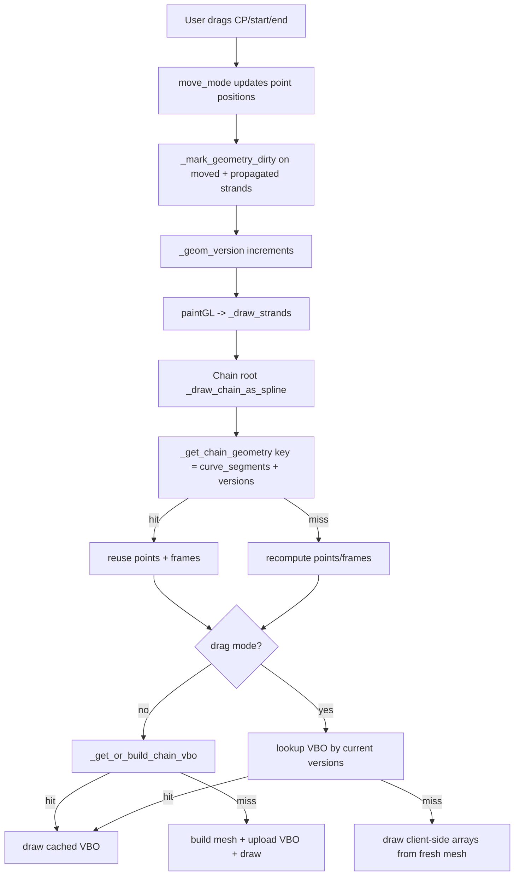
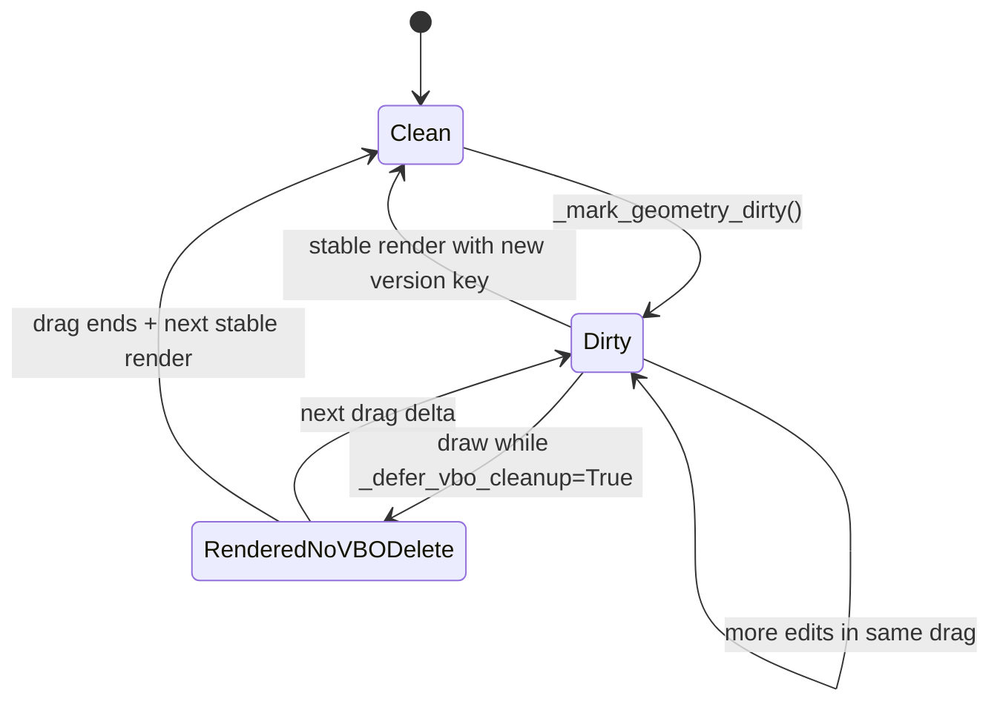
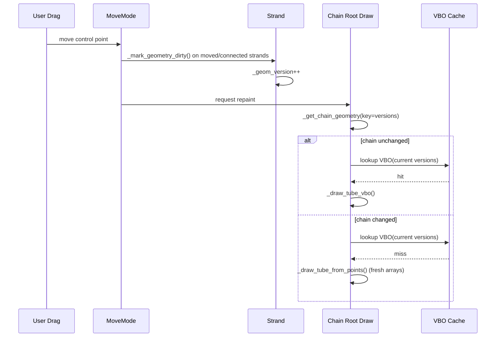

# Rendering Pipeline V3: NumPy + VBO + Cache/Dirty-Strand Model

## 1) What This V3 Doc Adds

This version focuses on the newest rendering changes and explains, in one place:

- exactly what changed from old to new approaches
- how VBO caching works in normal mode and during drag
- what a "dirty strand" is and how dirty state propagates
- how cache keys prevent stale geometry from being reused

This is based on the recent rendering commits:

- `3d4bc3d` (2026-02-08): vectorized mesh path, removed display-list cache, draw-arrays path
- `5abbd6a` (2026-02-08): drag-time VBO reuse for non-affected chains, vectorized Bezier, optimized frame computation, float32-throughout mesh

---

## 2) Files Reviewed For This V3

### Documentation files

- `docs/rendering_pipeline.md`
- `docs/generate_pipeline_doc.py`
- `docs/rendering_pipeline.pdf`

### Rendering implementation files

- `src/strand.py`
- `src/move_mode.py`
- `src/attached_strand.py`
- `src/strand_drawing_canvas.py`

---

## 3) Core Terms

- **Chain root**: first strand of a chain; this is where chain draw/caches are managed.
- **Dirty strand**: strand whose geometry changed this frame. In code, this means `_geom_version` was incremented by `_mark_geometry_dirty()`.
- **Affected chain**: any chain containing at least one dirty strand.
- **Cache version tuple**: tuple of `(id(strand), strand._geom_version)` per strand, used in cache keys.

---

## 4) Old vs New Approaches (Exact Evolution)

| Era | Geometry Build | GL Submission | Drag Behavior | Main Issue/Win |
|---|---|---|---|---|
| V1 (original) | Python nested loops | Immediate mode (`glBegin`/`glVertex3f`) | Heavy full rebuild | Very slow for large chains |
| V2 (`3d4bc3d`) | NumPy vectorized `_build_tube_mesh()` | Batched arrays (`glVertexPointer` + `glDrawArrays`) | No display-list cache; redraw all strands each frame | Big speedup, removed stale display-list bug |
| V3 (`5abbd6a`, current) | V2 + vectorized `get_curve_points()` + faster frame loop + float32-throughout mesh | Same batched path + VBO reuse improvements | During drag: non-affected chains can render from cached VBO; affected chain uses fresh arrays | Major drag FPS jump with clean cache semantics |

### Exact "before vs after" highlights

1. `get_curve_points()`:
- before: Python loop over segments calling `get_bezier_point(t)` repeatedly
- now: one vectorized NumPy Bezier broadcast per strand

2. `_build_tube_mesh()`:
- before: Python double loops assembling triangle arrays
- now: broadcasted `(N, R, 3)` array math, vectorized normal handling, contiguous float32 output

3. `_draw_tube_from_points()`:
- old (pre-`3d4bc3d`): per-vertex immediate mode calls
- now: prebuilt arrays + one `glDrawArrays(GL_TRIANGLES, ...)`

4. `_draw_chain_as_spline()` during drag:
- before `5abbd6a`: build fresh arrays every drag frame
- now: first try VBO cache hit for unchanged chain versions; rebuild arrays only on miss

---

## 5) End-to-End Pipeline (V3)



---

## 6) Dirty-Strand and Cache Invalidation Model



### 6.1 What makes a strand dirty

`_mark_geometry_dirty()` in `src/strand.py`:

- increments `_geom_version`
- clears per-strand curve/frame caches
- clears chain geometry cache on that root
- clears VBO cache only when cleanup is not deferred

During drag, VBO cleanup is deferred (`Strand._defer_vbo_cleanup = True`), so old VBO objects are not deleted immediately. They are naturally bypassed if versions changed, because keys no longer match.

### 6.2 Dirty propagation

Move operations in `src/move_mode.py` mark geometry dirty on:

- the directly edited strand
- connected parent/attached strands when endpoints are linked
- linked control-point neighbors when C1 syncing is enabled

`_propagate_to_attached_strands()` updates only the connected endpoint of attached strands (2D-style behavior), then marks them dirty.

`src/attached_strand.py` also avoids whole-strand moves in `set_end()` by deferring endpoint propagation to move-mode logic.

### 6.3 Why stale geometry is avoided

Because cache keys include version tuples, stale cache entries survive temporarily but cannot be selected if geometry changed. New versions produce new keys.

---

## 7) Cache Layers and Keys

| Layer | Data | Key | Invalidated By |
|---|---|---|---|
| Curve cache (`_curve_cache`) | per-strand Bezier points | `num_segments + _geom_version` | strand geometry change |
| Frame cache (`_frame_cache`) | per-strand local frames | `num_segments + _geom_version` | strand geometry/twist change |
| Chain cache (`_chain_cache`) | merged chain points + frames | `curve_segments + tuple((id,version),...)` | any strand in chain changes |
| VBO cache (`_vbo_cache`) | GPU buffers + vertex count | `curve_segments + tube_segments + tuple((id,version),...)` | version mismatch or cleanup/prune |

### VBO prune behavior

- normal: small cap (`max_entries=6`)
- drag: allows larger temporary cache (`<= 30`) to avoid frequent GPU deletion/sync stalls

---

## 8) VBO Deep Dive (Detailed)

### 8.1 VBO build path (normal mode)

In `_get_or_build_chain_vbo()`:

1. build key from render resolution + strand version tuple
2. cache hit -> return existing VBO handles immediately
3. cache miss:
   - build mesh arrays (`vertices`, `normals`)
   - create GPU buffers with `glGenBuffers`
   - upload with `glBufferData(..., GL_STATIC_DRAW)`
   - store handles and vertex count in `_vbo_cache`

### 8.2 VBO draw path

In `_draw_tube_vbo()`:

1. bind vertex VBO
2. point vertex pointer to bound buffer (`offset=None`)
3. bind normal VBO
4. point normal pointer
5. `glDrawArrays(GL_TRIANGLES, ...)`

No CPU triangle loop here; this is GPU draw from cached data.

### 8.3 Why drag mode uses mixed behavior

During drag (`_defer_vbo_cleanup=True`):

- unchanged chains: can still hit matching VBO keys and draw fast from GPU
- changed chain: version tuple changed, VBO key misses, so it draws fresh client-side arrays this frame

This avoids pointless VBO upload churn for geometry that changes every frame.

### CPU vs GPU memory path

```text
VBO hit path (unchanged chain):
  CPU key lookup -> bind GPU VBOs -> glDrawArrays

Client-side path (changed chain during drag):
  CPU rebuild mesh -> glVertexPointer(array in RAM) -> glDrawArrays
```

---

## 9) NumPy Pipeline Details (Current V3)

### 9.1 Bezier point generation

`get_curve_points()` now computes all `S+1` points in one broadcasted expression:

`pts = B0(t)*P0 + B1(t)*P1 + B2(t)*P2 + B3(t)*P3`

with all Bernstein terms vectorized.

### 9.2 Mesh assembly

In `_build_tube_mesh()`:

- points, right/up frames, and cross-section factors are arranged into broadcast-friendly shapes
- ring quads for all segments are generated in vectorized batches
- triangles are packed as contiguous float32 arrays

Shape intuition:

- curve segments: `N`
- ring samples: `R`
- coordinates: `3`
- major arrays: `(N, R, 3)`

### 9.3 Frame computation strategy

`_compute_chain_frames()` is sequential by nature, so it uses:

- vectorized tangent precompute in NumPy
- scalar math inside the sequential transport loop

This avoids heavy per-iteration NumPy call overhead on tiny 3-element vectors.

---

## 10) Drag-Frame Behavior: Affected vs Unaffected Chains



---

## 11) Practical "Old vs New" Summary

### Old model (pain points)

- heavy Python loops in geometry path
- immediate-mode per-vertex GL calls
- display-list era had stale-geometry edge cases during connected-strand drag

### New model (V3)

- vectorized curve + mesh math
- draw-arrays/VBO path for batched rendering
- strict versioned cache keys
- dirty propagation aligned with connection rules
- drag-time strategy that preserves speed and correctness

---

## 12) Code Reference Map (Current Source)

### `src/strand.py`

- dirty marking + deferred cleanup: `src/strand.py:91`
- VBO prune policy: `src/strand.py:123`
- drag lifecycle flags: `src/strand.py:134`, `src/strand.py:139`
- vectorized Bezier points: `src/strand.py:197`
- chain draw decision path: `src/strand.py:421`
- chain geometry cache: `src/strand.py:464`
- VBO get/build: `src/strand.py:566`
- vectorized mesh build: `src/strand.py:602`
- VBO draw path: `src/strand.py:687`
- optimized chain frame computation: `src/strand.py:703`
- client-side draw path: `src/strand.py:891`

### `src/move_mode.py`

- begin deferred drag cleanup: `src/move_mode.py:1058`
- dirty marking during move updates: `src/move_mode.py:1160`
- propagation to connected strands: `src/move_mode.py:1243`
- attached strand endpoint propagation: `src/move_mode.py:1287`
